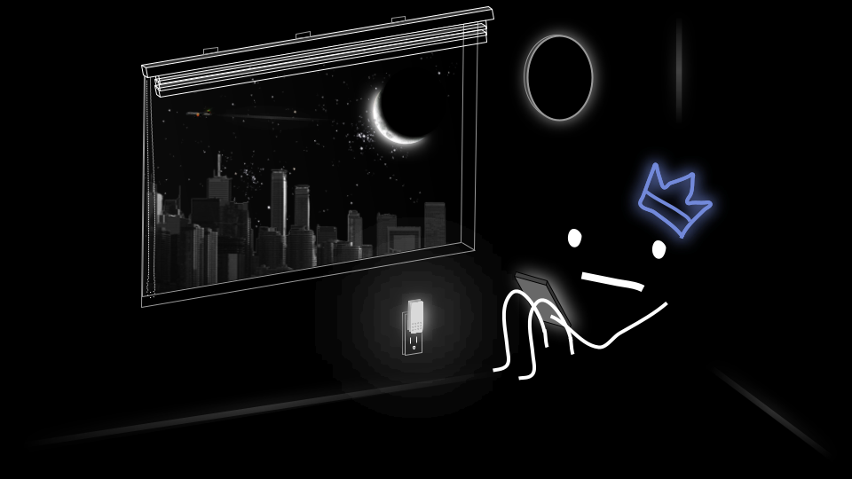
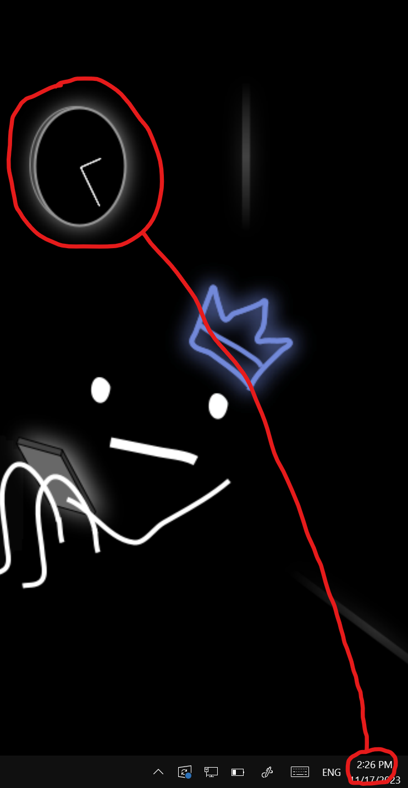

Ok so basically this script takes my <a src="image/wallpaper.png">desktop wallpaper</a>
and draws the hands on the clock in accordance with the time (or any time that you specify through the CLI)
  
yes I made a CLI with this don't ask
template (in [image/wallpaper.png](https://github.com/fuh-Q/desktop-bg/blob/master/image/wallpaper.png))| 2:26 PM, as an example
--- | ---
|
 
also my first time doing rust so ya
