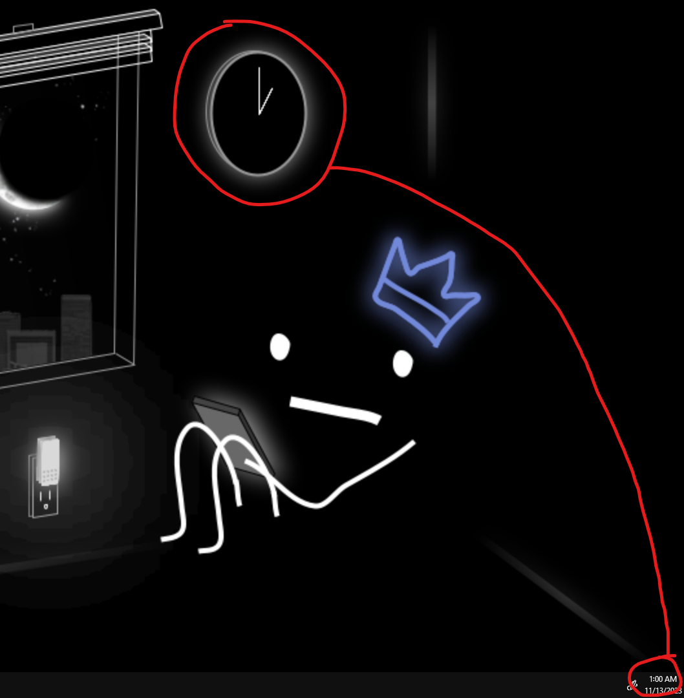

okay so basically this script takes my <a src="image/wallpaper.png">desktop wallpaper</a>
and draws the hands on the clock in accordance with the time (or any time that you specify through the CLI)
  
yes i made a CLI with this don't ask

also my first time doing rust so ya
